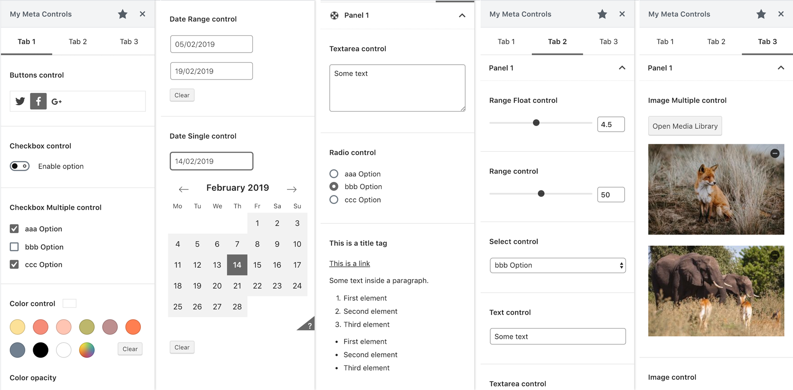

# Post Meta Controls

WordPress plugin that provides utilities to register, save and modify post meta data in the Gutenberg editor.

Register, Save, Modify and Get meta data in the Gutenberg editor.
Use this plugin to add meta data controls inside a sidebar in the editor of posts, pages or custom post types.

The plugin comes with different options to customize the Sidebars, Tabs, Panels and Setting controls.

 

## Features

This is the list of controls available:

- Buttons
- Checkbox, Checkbox Multiple
- Color, Color with Alpha
- Custom text
- Date Range, Date Single
- Image, Image Multiple
- Radio
- Range, Range with Float number
- Select
- Text, Textarea

 

## Screenshots

 

## Usage

To check the documentation please refer to the [WordPress repository](https://wordpress.org/plugins/post-meta-controls) (until the documentation page is finished).

---

This plugin can be downloaded from the [WordPress repository](https://wordpress.org/plugins/post-meta-controls).
